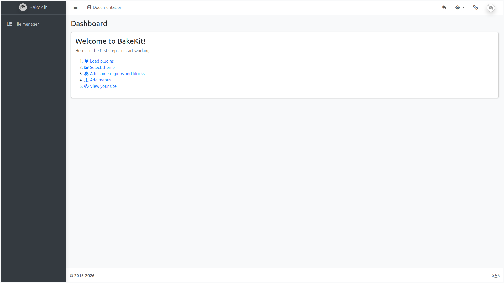
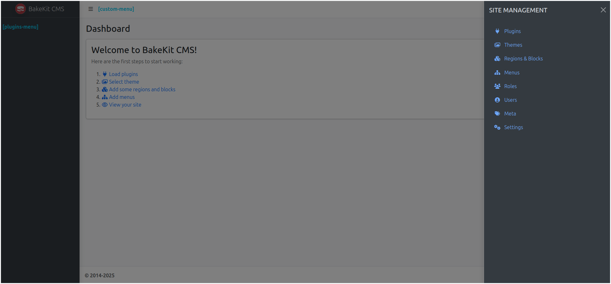
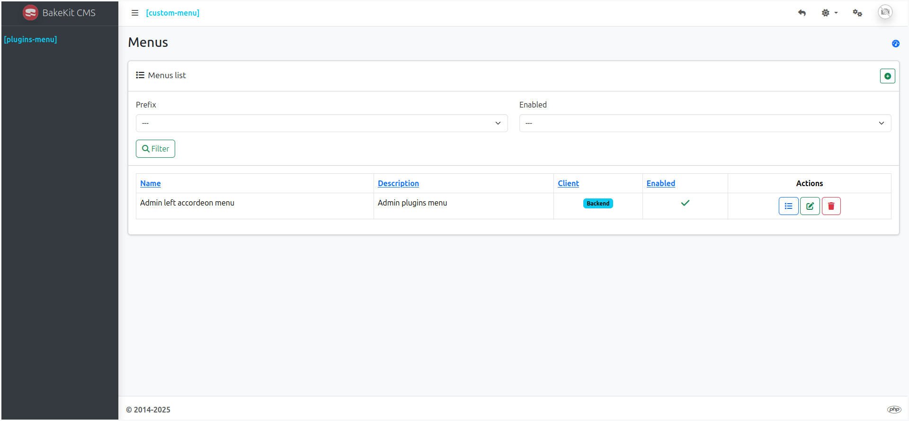
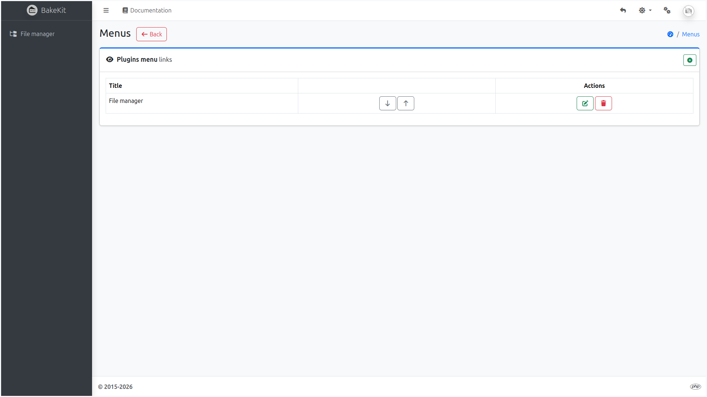
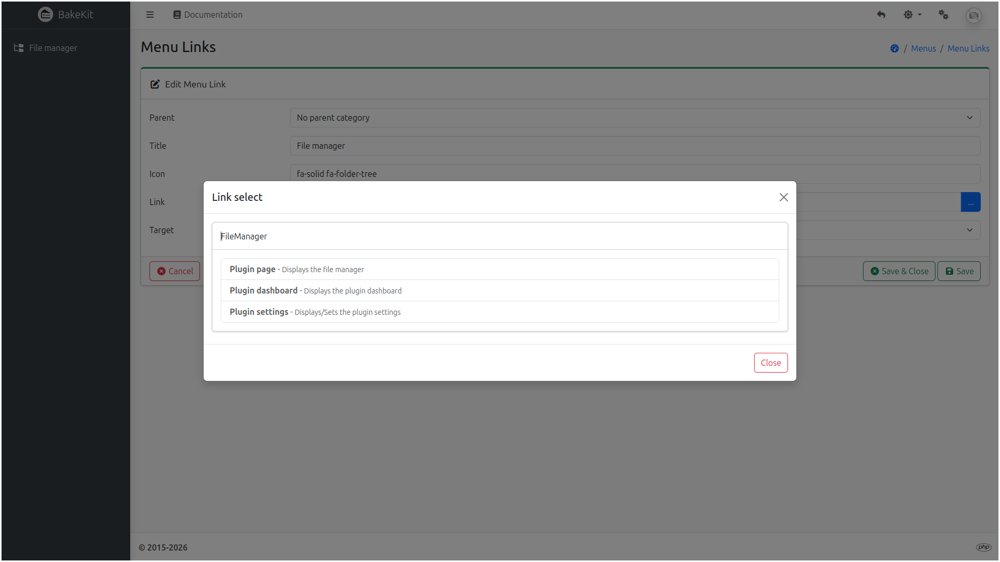

# 🚀 Quick Start – BakeKit

Welcome to **BakeKit**! This quick start guide will help you get up and running in minutes.

> This guide assumes you've already downloaded or cloned BakeKit from GitHub and have it running in a local development environment.

---

## 🧰 Site Management Panel

Once launched, you’ll see a clean dashboard. All features in BakeKit are **plugin-based**, so nothing is enabled by default.

There are two predefined menus:

- **Plugins menu** – For menu populated with plugin links (Pages, Blog, etc.)
- **Custom menu** – For menu with custom links



To begin configuring your site, click the ⚙️ **cogs icon** in the top-right corner of the dashboard to access the **Site Management Panel**, where you can:

- Manage Plugins, Themes, Menus, Roles, Users, Meta, and Settings



---

## 🧩 1. Load a Plugin

To enable features like static pages, blog posts, or slideshows, you need to install and activate plugins.

👉 **Tip:** Start by installing the **FileManager** plugin — it’s required by other plugins for image handling.

Install via Git:

```bash
git clone https://github.com/bakewizard/FileManager.git
zip -r FileManager.zip FileManager
rm -rf FileManager
```

1. Go to the **Plugins** page and click **Browse**.
2. Upload the FileManager.zip file.
3. Click Install, then Activate.

---

## 🧭 2. Edit a Menu Item

1. Navigate to the **Menus** page.
2. In the **Actions** column of **Plugins menu**, click the first button to manage menu links.
3. Click the **📝 icon** to edit the first link.
4. Click the **Link** button and choose **Plugin page** from the accordion **FileManager** tab.
5. Click **Save & Close**.







---

## 📦 3. Load a Theme

To install and activate a new theme:

1. Go to the **Themes** page.
2. Click **Browse** and select the theme `.zip` file.
3. Click **Install**, then **Activate**.

---

## 🛠️ Next Steps

BakeKit is now set up!

You can now:

- Install [plugins](plugins.md)
- Install [themes](themes.md)
- Create dynamic content
- Tweak advanced settings
