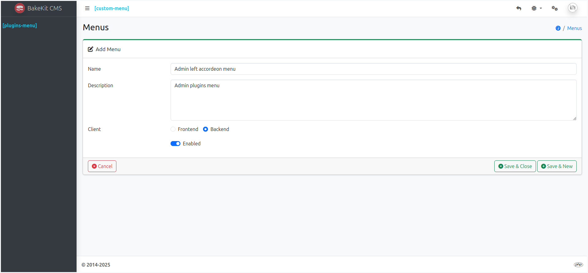
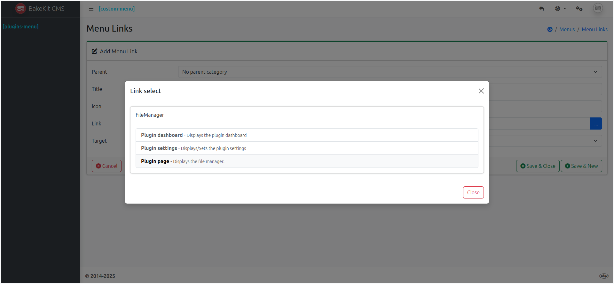
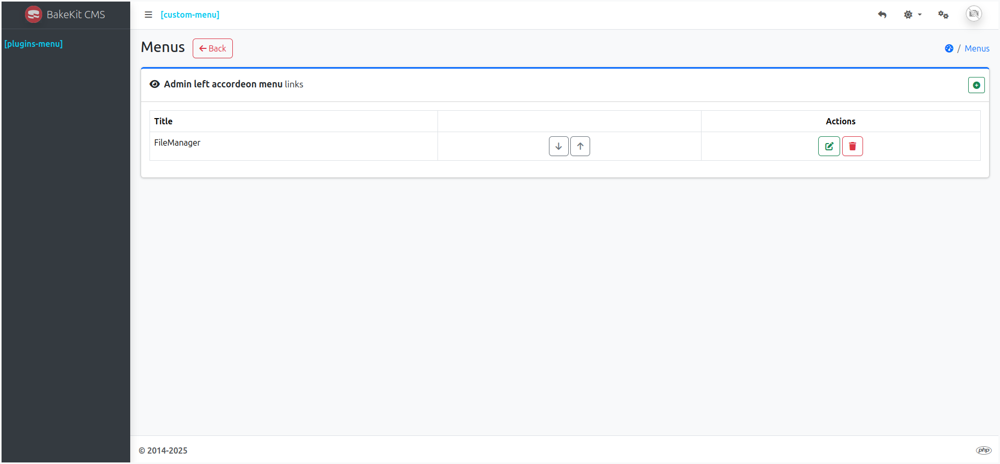
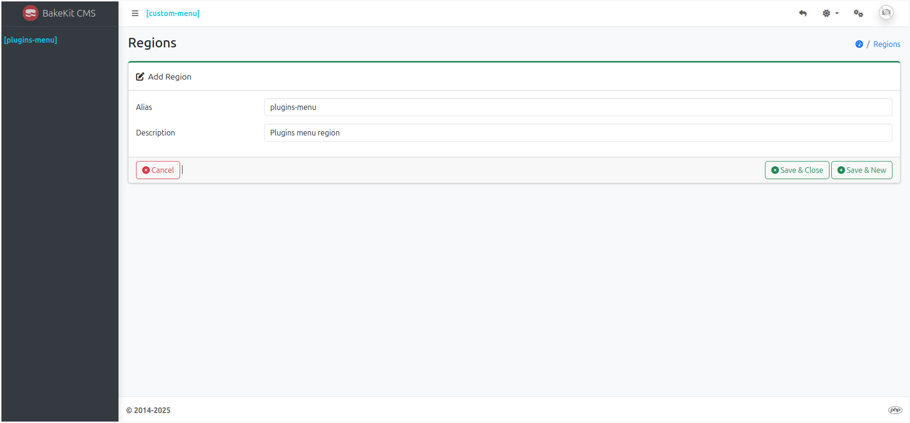
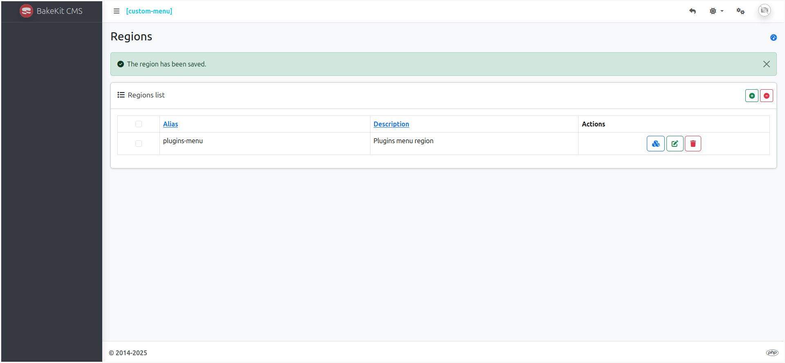
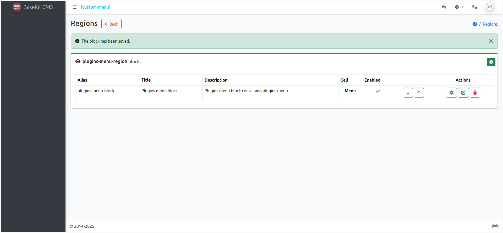
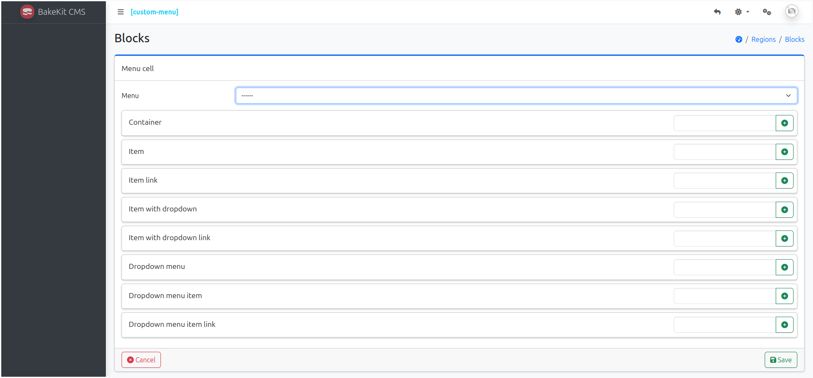

# 🚀 Quick Start – BakeKit CMS

Welcome to **BakeKit CMS**! This quick start guide will help you get up and running in minutes.

> This guide assumes you've already downloaded or cloned BakeKit CMS from GitHub and have it running in a local development environment.

---

## 🧰 Site Management Panel

Once launched, you’ll see a clean dashboard. All features in BakeKit CMS are **plugin-based**, so nothing is enabled by default.

At the top of the dashboard, there are two predefined region placeholders:

- **[plugins-menu]** – For menus populated with plugin links (Pages, Blog, etc.)
- **[custom-menu]** – For menus with custom links


To begin configuring your site, click the ⚙️ **cogs icon** in the top-right corner of the dashboard to access the **Site Management Panel**, where you can:

- Manage Plugins, Themes, Regions, Menus, Roles, Users, Meta, and Settings


---

## 🧩 1. Load a Plugin

To enable features like static pages, blog posts, or slideshows, you need to install and activate plugins.

👉 **Tip:** Start by installing the **FileManager** plugin—it’s often required by other plugins for image handling.

### Install via Git:

```bash
git clone https://github.com/bakewizard/FileManager.git
zip -r FileManager.zip FileManager
rm -rf FileManager
```

1. Go to the **Plugins** page and click **Browse**.
2. Upload the FileManager.zip file.
3. Click Install, then Activate.

---

## 🧭 2. Add a Menu

1. Navigate to the **Menus** page.
2. Click the **➕ icon** to create a new menu.
3. Fill in the fields:
    - **Name**: `Admin left accordion menu`
    - **Description**: `Admin plugins menu`
    - **Client**: Select `Backend`.
    - **Enabled**: ✅ Checked.
4. Click **Save & Close**.



The menu will appear in the **Menus** page:


To add links to the menu:

1. In the **Actions** column, click the first button to manage menu links.
2. Click the **➕ icon** to add a new link.
3. Fill in the fields:
    - **Title**: `FileManager`
    - **Icon**: Enter a Bootstrap or FontAwesome class (e.g., bi-folder, fa fa-file)
    - Click the **Link** button and choose **Plugin page** from the accordion.
4. Click **Save & Close**.



The new link will be added to the menu:



---

## 🧱 3. Add a Region with a Block

To render the admin menu in your layout:

1. Go to **Regions & Blocks**.
2. Click the **➕ icon** to create a new region.
3. Enter the details:
    - **Alias**: `plugins-menu` (must match the placeholder name).
    - **Description**: `Plugins menu region`.
4. Click **Save & Close**.



The region will now appear in the list:



To add a block to the region:

1. In the **Actions** column, click the first button to manage blocks.
2. Click the **➕ icon** to create a block.
3. Fill in the details:
    - **Alias**: `plugins-menu-block` (must be a unique identifier: a-z, 0-9, -).
    - **Title**: `Plugins menu block`.
    - **Description**: `Plugins menu block containing plugins menu`.
    - Click the **Cell** button and choose **'Menu cell'** from the accordion.
    - **Enabled**: ✅ Checked.
4. Click **Save & Close**.



Finally, configure the new block:

1. In the **Actions** column, click the ⚙️ **icon**.
2. Select **Admin left accordion menu** from the dropdown.
3. Click **Save**.



You should now see the **FileManager** link in the admin sidebar.

---

## 📦 4. Load a Theme

To install and activate a new theme:

1. Go to the **Themes** page.
2. Click **Browse** and select the theme `.zip` file.
3. Click **Install**, then **Activate**.

> 💡 Alternatively, unzip a theme manually into the /themes directory. It will appear in the theme list for activation.

---

### 🛠️ Next Steps

BakeKit CMS is now set up!

You can now:

- Customize layouts
- Create dynamic content
- Tweak advanced settings
- Install additional plugins
